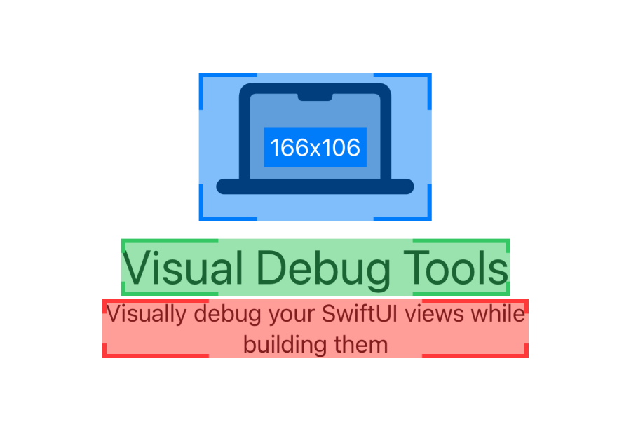

# Visual Debug Tools
Visual Debug Tools is a small set of utilities for SwiftUI that allows you to visually debug your views as you build them. 

# Installation
Visual Debug Tools are available through SPM. 
```
https://github.com/heyrodrigo/visual-debug-tools
```

# Usage
To visually debug a view add the view modifier `.debug()`. This will show the views bounds and size.

```swift
struct DemoView: View {
    var body: some View {
        Text("Visual Debug Tools")
            .font(.largeTitle)
            .debug()
    }
}
```

To discover when the body property of a view is being reinvoked add the view modifier `.debugViewUpdate()`. This assigns a random background/overlay color to your view.
```swift
struct DemoView: View {
    var body: some View {
        Text("Visual Debug Tools")
            .font(.largeTitle)
            .debugViewUpdate()
    }
}
```

# Author
Rigo Rigo AB.
